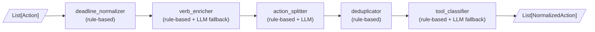

# Action Normalizer Agent

## What It Does

Takes the output of the existing action extractor (`List[Action]`) and produces `List[NormalizedAction]` — each item ready to execute as a real tool call (email, Jira, calendar, Notion, etc.).

## Current Extractor Modifications (minimal, to reduce LLM calls)

One small addition to `[src/langgraph_models.py](src/langgraph_models.py)`: add an `action_category` field to `ActionDetails`. The extractor LLM already sees enough context to tag this for free in the same prompt call — no extra LLM cost.

```python
action_category: Literal["communication", "task", "event", "documentation", "other"] | None
```

This single hint lets the tool classifier skip LLM calls for 80%+ of actions.

Also update the extractor's `verb` extraction: currently every action outputs `"do"`. The `action_finalizer_node` in `[src/langgraph_nodes.py](src/langgraph_nodes.py)` should extract the leading verb from `description` using regex before writing to `Action.verb`.

---

## New Files

- `src/action_normalizer_models.py` — `ToolType` enum + `NormalizedAction` Pydantic model
- `src/action_normalizer_data.py` — Pure data: verb upgrade dict, tool-verb map, deadline patterns
- `src/action_normalizer_state.py` — `NormalizerState` TypedDict
- `src/action_normalizer_nodes.py` — 5 LangGraph nodes (described below)
- `src/action_normalizer_workflow.py` — LangGraph graph wiring
- `run_normalizer.py` — CLI entry point (reads output.json → writes normalized_output.json)

---

## Normalizer Pipeline




---

## Node Details

### 1. `deadline_normalizer_node` (rule-based only)

Uses `dateutil.parser` + a custom rule table. Reference date = today (Mar 5, 2026) or inferred from transcript.


| Raw deadline          | Normalized                   |
| --------------------- | ---------------------------- |
| `"after the meeting"` | `"2026-03-05"` (today)       |
| `"later"`             | `null`                       |
| `"March 10"`          | `"2026-03-10"`               |
| `"next week"`         | `"2026-03-09"` (next Monday) |
| `"end of day"`        | `"2026-03-05"`               |
| `"tomorrow"`          | `"2026-03-06"`               |


### 2. `verb_enricher_node` (rule-based + LLM fallback)

**Step 1 — Extract verb from description** (regex, no LLM):

```
"Draft update email to client" → verb = "draft"
"Talk to finance to inform them" → verb = "talk_to"
"Schedule bug bash session" → verb = "schedule"
```

**Step 2 — Upgrade weak verbs** (dictionary lookup, no LLM):

```python
VERB_UPGRADES = {
    "talk to":      "notify",
    "speak with":   "notify",
    "tell":         "notify",
    "circle back":  "follow_up",
    "look into":    "investigate",
    "check on":     "review",
    "go over":      "review",
    "take care of": "resolve",
    "deal with":    "handle",
    "do":           "(extracted from description)",
}
```

**Step 3 — LLM fallback** only when extracted verb is still ambiguous (e.g., verb is missing from description entirely). This should be rare (<10% of actions).

### 3. `action_splitter_node` (rule-based + LLM)

**Rule-based detection** — flag descriptions matching compound patterns:

- `"X and Y"` where both X and Y contain an action verb from a known set
- Explicit conjunctions: `"as well as"`, `"also"`, `"additionally"`
- Example: `"Circle back to flaky tests to investigate and resolve the issue"` → two actions

**LLM call** — only for flagged actions, with a tight prompt:

> "Split this action item into the minimal number of atomic tool-executable actions. Return JSON array."

This keeps LLM calls proportional to compound actions only.

### 4. `deduplicator_node` (rule-based only)

Token-level Jaccard similarity (threshold 0.6) on description, combined with:

- Same `assignee`
- Same `tool_type` (after classification) OR same `verb`

When duplicates found: keep highest `confidence`, merge `source_spans`.

### 5. `tool_classifier_node` (rule-based + LLM fallback)

Primary signal: upgraded `verb` + `action_category` from extractor. Secondary: keyword scan of `description`.

```python
TOOL_VERB_MAP = {
    "send":        ToolType.SEND_EMAIL,
    "draft":       ToolType.SEND_EMAIL,
    "email":       ToolType.SEND_EMAIL,
    "notify":      ToolType.SEND_NOTIFICATION,
    "inform":      ToolType.SEND_NOTIFICATION,
    "schedule":    ToolType.SET_CALENDAR,
    "book":        ToolType.SET_CALENDAR,
    "create_task": ToolType.CREATE_JIRA_TASK,
    "fix":         ToolType.CREATE_JIRA_TASK,
    "investigate": ToolType.CREATE_JIRA_TASK,
    "review":      ToolType.CREATE_JIRA_TASK,
    "document":    ToolType.CREATE_NOTION_DOC,
    "write_up":    ToolType.CREATE_NOTION_DOC,
}
```

Each `tool_type` gets its own `tool_params` extractor (regex-based):

- `send_email`: extracts `to`, `subject_hint`, `body_hint`
- `create_jira_task`: extracts `title`, `priority`, `due_date`
- `set_calendar`: extracts `event_name`, `datetime`, `participants`
- `create_notion_doc`: extracts `page_title`, `content_hint`

LLM fallback only when `verb` maps to nothing and `action_category` is `"other"`.

---

## Output Schema (`NormalizedAction`)

```python
class NormalizedAction(BaseModel):
    id: str                        # uuid4
    description: str               # cleaned, atomic description
    assignee: str | None
    raw_deadline: str | None       # original value from extractor
    normalized_deadline: str | None  # ISO 8601 or null
    speaker: str
    verb: str                      # upgraded verb
    confidence: float
    tool_type: ToolType
    tool_params: dict              # tool-specific parameters
    source_spans: list[str]
    parent_id: str | None          # set if this was split from a compound action
    meeting_window: tuple[int,int] | None
```

**Example output for the 7 actions in `output.json`:**


| Input description                                     | Split?      | Tool                  | Normalized deadline |
| ----------------------------------------------------- | ----------- | --------------------- | ------------------- |
| Circle back to flaky tests to investigate and resolve | → 2 actions | `create_jira_task` x2 | null                |
| Draft update email to client                          | —           | `send_email`          | 2026-03-05          |
| Schedule bug bash session March 10                    | —           | `set_calendar`        | 2026-03-10          |
| Talk to finance to inform them                        | —           | `send_notification`   | null                |
| Create and track a task for fixing monitoring alerts  | —           | `create_jira_task`    | null                |
| Add accessibility review to task list                 | —           | `create_jira_task`    | null                |
| Check color contrast for accessibility                | —           | `create_jira_task`    | null                |


---

## Integration

- **Standalone**: `python run_normalizer.py --input output.json --output normalized_output.json`
- **Chained**: `run_langgraph.py` can optionally pipe its `List[Action]` result directly into the normalizer workflow (no file I/O between steps)

