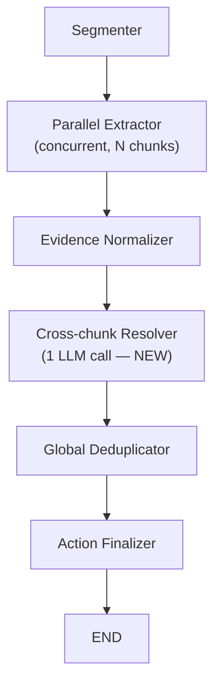

# Cross-chunk Resolver Node

## The problem

The parallel extractor processes each chunk in isolation. Two failure modes that the text-similarity deduplicator cannot handle:

1. **Same task, different vocabulary** — chunk 1: `"handle the api gateway migration"`, chunk 2: `"prepare migration plan with rollback"` — share few content words, don't merge.
2. **Cross-chunk pronoun resolution** — `"I'll do that"` in chunk N where `"that"` was introduced in chunk N-1.

## Solution: one post-extraction LLM pass

Add a `cross_chunk_resolver_node` that runs **after** all parallel extraction is done. It receives the full list of candidate actions and makes a single LLM call to semantically merge duplicates and resolve vague references. Parallel extraction is unchanged.

New pipeline:




---

## Prerequisite: enrich the extractor output

The cross-chunk resolver needs richer signal than the current `Action` fields provide. Two fields are extracted from the LLM prompt now but are **silently dropped** before reaching the resolver:

- `resolved_context` / `context_unclear` — the flag for unresolved pronouns is known during extraction but thrown away when `Segment` is converted to `Action`.
- There is no topic label — descriptions vary in vocabulary across chunks, making semantic matching hard for the resolver.

### New fields on `ActionDetails` and `Action`

`**topic_tags: List[str]**` — 2–4 short keywords capturing the *subject* of the action, independent of verb and phrasing. Extracted by the LLM at no extra cost as part of the same call. Example: both `"draft update email to Client Delta"` and `"send client communication about delivery timeline"` would tag `["client", "email", "scope"]`.

`**unresolved_reference: str | None**` — when the extractor marks `context_unclear=True`, it also records *what it thinks is being referenced* even if it cannot fully resolve it: e.g. `"the migration task"`, `"what John said about the tests"`. This becomes a search key the resolver uses against topic tags from other chunks.

### Changes needed

- `[src/langgraph_models.py](src/langgraph_models.py)` — add both fields to `ActionDetails` and `Action`
- `[src/langgraph_nodes.py](src/langgraph_nodes.py)` `_extract_single_chunk` prompt — instruct the LLM to populate both fields
- `[src/langgraph_nodes.py](src/langgraph_nodes.py)` `evidence_normalizer_node` — pass both fields through when building `Action` objects

---

## What the new resolver node does

**Input:** `merged_actions` list from `evidence_normalizer` — now enriched with `topic_tags` and `unresolved_reference`.

The resolver formats each action for the prompt like:

```
[0] chunk=1  speaker=John  tags=[client,email,scope]
    "Draft update email to Client Delta to reset expectations"
[1] chunk=1  speaker=John  tags=[bug-bash,testing,release]  unresolved_ref="what we discussed earlier"
    "Handle it before release"
[2] chunk=2  speaker=John  tags=[client,email,timeline]
    "Send client communication about delivery timeline and scope changes"
```

**LLM prompt tasks:**

1. Identify actions that are the same real-world task described differently (using tags and descriptions) — return groups of indices to merge.
2. For any action with `unresolved_ref`, find the most likely matching action from another chunk and rewrite the description to be self-contained.
3. If a later action provides a missing `deadline` or `assignee` for an earlier one, return a field update.

**Output structure (Pydantic):**

```python
class CrossChunkResolution(PydanticBaseModel):
    merge_groups: List[List[int]]   # e.g. [[0, 2], [1, 3]] — groups to merge
    updates: List[Dict[str, Any]]   # e.g. [{index: 1, description: "Schedule bug bash before release"}]
```

**Merge logic (no LLM):** For each group, keep the most specific description (longest), carry over any non-null `assignee`/`deadline`/`topic_tags` from members, merge `source_spans`.

**Skip condition:** If there is only 1 chunk or fewer than 2 actions, skip the LLM call entirely and pass through unchanged.

**Fallback:** If the LLM call fails or returns an invalid structure, log the error and pass the action list through unmodified — same output as today.

---

## Files to change

- `[src/langgraph_models.py](src/langgraph_models.py)` — add `topic_tags` and `unresolved_reference` to `ActionDetails` and `Action`
- `[src/langgraph_nodes.py](src/langgraph_nodes.py)` — update extraction prompt + `evidence_normalizer` field passthrough; add `cross_chunk_resolver_node()` and `_apply_cross_chunk_resolution()`
- `[src/langgraph_workflow.py](src/langgraph_workflow.py)` — insert the new node between `evidence_normalizer` and `global_deduplicator`
- `[src/langgraph_llm_config.py](src/langgraph_llm_config.py)` — add `CROSS_CHUNK_RESOLVER_CONFIG`
- `[configs/gemini_mixed.env](configs/gemini_mixed.env)` and `[configs/claude.env](configs/claude.env)` — add `CROSS_CHUNK_RESOLVER_*` settings

---

## Expected runtime impact


| Stage                  | Before | After                 |
| ---------------------- | ------ | --------------------- |
| Parallel extraction    | ~15s   | ~15s (unchanged)      |
| Cross-chunk resolution | —      | +5–10s (one LLM call) |
| Total                  | ~17s   | ~22–25s               |


The cost is one extra sequential LLM call. The benefit is correct handling of cross-chunk duplicates and pronoun resolution that the deduplicator currently misses.