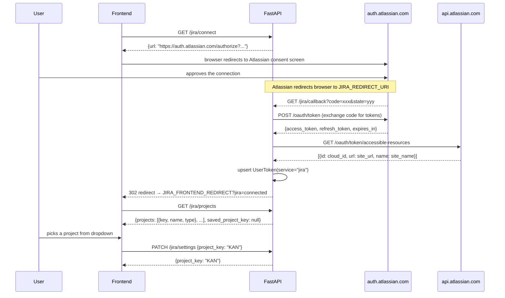

# Jira Integration API

Allows users to connect their Atlassian/Jira account via OAuth 2.0 (3LO). Once connected, their access token and refresh token are stored securely and used by the pipeline to create and manage Jira issues.

**Base URL (local):** `http://localhost:8000`  
**Interactive docs:** `http://localhost:8000/docs`

---

## Endpoints

| Method | Path | Auth required | Description |
|--------|------|:---:|-------------|
| `GET` | `/jira/connect` | Yes | Get the Atlassian OAuth authorization URL to redirect the user to |
| `GET` | `/jira/callback` | No | Atlassian redirects here after the user approves — exchanges code for tokens and stores them |
| `GET` | `/jira/status` | Yes | Check connection state and saved default project key |
| `DELETE` | `/jira/disconnect` | Yes | Remove the user's stored Jira tokens |
| `GET` | `/jira/projects` | Yes | List all Jira projects accessible to the user |
| `PATCH` | `/jira/settings` | Yes | Save the user's default Jira project key |

All protected routes accept the JWT via **`Authorization: Bearer <token>`**.

---

## OAuth + Project Setup Flow

```
1. Frontend calls GET /jira/connect → gets a URL
2. Frontend redirects the user to that URL (Atlassian's consent screen)
3. User approves → Atlassian redirects to GET /jira/callback (your backend)
4. Backend exchanges the code for access + refresh tokens
5. Backend calls accessible-resources to resolve the user's cloud_id and site_url
6. Backend stores the tokens, redirects user to JIRA_FRONTEND_REDIRECT
7. Frontend detects ?jira=connected → calls GET /jira/projects
8. Frontend shows a project picker (dropdown)
9. User picks a project → frontend calls PATCH /jira/settings
10. Default project key saved — pipeline execute works without passing projectKey every time
```



---

## Setup

### 1. Create an Atlassian OAuth 2.0 app

1. Go to [developer.atlassian.com/console/myapps](https://developer.atlassian.com/console/myapps/)
2. Click **Create** → **OAuth 2.0 integration**
3. Give it a name and accept the terms

### 2. Configure authorization

1. In your app, go to **Authorization**
2. Click **Add** next to **OAuth 2.0 (3LO)**
3. Set the **Callback URL** to your redirect URI:
   - Local dev (via ngrok): `https://your-static-name.ngrok-free.app/jira/callback`
   - Production: `https://yourdomain.com/jira/callback`

### 3. Add API permissions

1. Go to **Permissions** in your app
2. Click **Add** next to **Jira API**
3. Click **Configure** and enable the following scopes:
   - `read:jira-user`
   - `read:jira-work`
   - `write:jira-work`
4. `offline_access` (refresh token) is requested automatically via the scope parameter

### 4. Get your credentials

1. Go to **Settings** in your app
2. Copy the **Client ID** and **Secret**

### 5. Set environment variables

Copy `.env.example` to `.env` and fill in:

```env
JIRA_CLIENT_ID=your-jira-client-id-here
JIRA_CLIENT_SECRET=your-jira-client-secret-here
JIRA_REDIRECT_URI=https://your-ngrok-url.ngrok-free.app/jira/callback
JIRA_FRONTEND_REDIRECT=http://localhost:5173/settings?jira=connected
```

---

## GET /jira/connect

Returns the Atlassian OAuth authorization URL. The frontend should redirect the user (or open a popup) to this URL.

### Request

**Authentication:** required. Send JWT via `Authorization: Bearer <token>`.

No request body or query parameters.

### Response

**Status:** `200 OK`

```json
{
  "url": "https://auth.atlassian.com/authorize?client_id=...&scope=read:jira-user+...&audience=api.atlassian.com&prompt=consent&state=..."
}
```

The URL includes `prompt=consent` to ensure a `refresh_token` is always returned by Atlassian.

### Example

```js
const res = await fetch('http://localhost:8000/jira/connect', {
  headers: { Authorization: `Bearer ${jwt}` },
});
const { url } = await res.json();
window.location.href = url;   // or open in a popup
```

---

## GET /jira/callback

> **Note:** This endpoint is called by Atlassian directly — not by your frontend code. You only need to be aware of it so you can handle the redirect it sends back to your frontend.

Atlassian sends the browser here after the user approves the connection. The API:

1. Validates the `state` parameter to identify the user.
2. Exchanges the `code` for an `access_token` and `refresh_token` via Atlassian's token endpoint.
3. Calls the `accessible-resources` endpoint to resolve the user's `cloud_id`, `site_url`, and `site_name`.
4. Saves the tokens to the database (`UserToken` with `service="jira"`), including `expires_at` and the Jira site metadata in `meta`.
5. Redirects the browser to `JIRA_FRONTEND_REDIRECT` (configured on the server).

### Query Parameters (sent by Atlassian)

| Parameter | Description |
|-----------|-------------|
| `code` | Temporary authorization code from Atlassian |
| `state` | Opaque state token issued by `/jira/connect` |

### Frontend handling

After the redirect, detect the result from the URL query string:

```js
// e.g. on /settings page mount
const params = new URLSearchParams(window.location.search);

if (params.get('jira') === 'connected') {
  // fetch /jira/projects and show project picker
}
```

### Error responses

| Status | When |
|--------|------|
| `400` | Invalid `state` parameter or Atlassian returned an OAuth error |
| `502` | Could not reach Atlassian's token endpoint |
| `503` | `JIRA_CLIENT_ID` / `JIRA_CLIENT_SECRET` not configured on the server |

---

## GET /jira/status

Check whether the current user has a connected Jira account and what their saved default project key is.

### Request

**Authentication:** required. Send JWT via `Authorization: Bearer <token>`.

### Response

**Status:** `200 OK`

```json
{
  "connected": true,
  "site_url": "https://yourcompany.atlassian.net",
  "site_name": "Your Company",
  "scope": "read:jira-user write:jira-work read:jira-work offline_access",
  "project_key": "KAN"
}
```

| Field | Type | Description |
|-------|------|-------------|
| `connected` | boolean | `true` if a Jira token exists for this user |
| `site_url` | string \| null | The Atlassian site URL, or `null` if not connected |
| `site_name` | string \| null | The human-readable name of the Atlassian site, or `null` if not connected |
| `scope` | string \| null | Space-separated list of granted OAuth scopes, or `null` if not connected |
| `project_key` | string \| null | The saved default project key (set via `PATCH /jira/settings`), or `null` if not yet saved |

### Example

```js
const res = await fetch('http://localhost:8000/jira/status', {
  headers: { Authorization: `Bearer ${jwt}` },
});
const { connected, site_name, project_key } = await res.json();

if (connected) {
  console.log(`Connected to "${site_name}", default project: ${project_key ?? 'not set'}`);
}
```

---

## DELETE /jira/disconnect

Remove the user's stored Jira tokens. Idempotent — returns `204` whether or not a token existed.

### Request

**Authentication:** required. Send JWT via `Authorization: Bearer <token>`.

No request body.

### Response

**Status:** `204 No Content`

### Example

```js
await fetch('http://localhost:8000/jira/disconnect', {
  method: 'DELETE',
  headers: { Authorization: `Bearer ${jwt}` },
});
// Tokens removed — update UI to show disconnected state
```

---

## GET /jira/projects

List all Jira projects the user has access to on their connected Atlassian site. Call this after `/jira/connect` to populate a project picker.

### Request

**Authentication:** required. Send JWT via `Authorization: Bearer <token>`.

No request body or query parameters.

### Response

**Status:** `200 OK`

```json
{
  "projects": [
    { "key": "KAN", "name": "Kanban Board", "type": "software", "style": "next-gen" },
    { "key": "ENG", "name": "Engineering", "type": "software", "style": "classic" },
    { "key": "PLAT", "name": "Platform", "type": "business", "style": "" }
  ],
  "saved_project_key": "KAN"
}
```

| Field | Type | Description |
|-------|------|-------------|
| `projects` | array | All projects accessible to the user, sorted by name |
| `projects[].key` | string | The project key used in issue identifiers (e.g. `KAN` in `KAN-5`) |
| `projects[].name` | string | Human-readable project name |
| `projects[].type` | string | `"software"`, `"business"`, or `"service_desk"` |
| `projects[].style` | string | `"next-gen"`, `"classic"`, or empty |
| `saved_project_key` | string \| null | The currently saved default from `PATCH /jira/settings`, or `null` |

### Error responses

| Status | When |
|--------|------|
| `403` | Jira not connected or token cannot be refreshed |
| `422` | `cloud_id` missing from token metadata — reconnect |
| `502` | Could not reach Atlassian API |

### Example

```js
const res = await fetch('http://localhost:8000/jira/projects', {
  headers: { Authorization: `Bearer ${jwt}` },
});
const { projects, saved_project_key } = await res.json();

// populate a <select> dropdown
projects.forEach(p => {
  const opt = document.createElement('option');
  opt.value = p.key;
  opt.textContent = `${p.name} (${p.key})`;
  opt.selected = p.key === saved_project_key;
  select.appendChild(opt);
});
```

---

## PATCH /jira/settings

Save the user's default Jira project key. Once saved, `POST /runs/{id}/jira_actions/execute` will use it automatically — no need to pass `projectKey` on every execute call.

### Request

**Authentication:** required. Send JWT via `Authorization: Bearer <token>`.

**Content-Type:** `application/json`

```json
{
  "project_key": "KAN"
}
```

| Field | Type | Required | Description |
|-------|------|:--------:|-------------|
| `project_key` | string | Yes | Jira project key to save as default (e.g. `"KAN"`). Case-insensitive — stored uppercased. |

### Response

**Status:** `200 OK`

```json
{
  "project_key": "KAN"
}
```

### Error responses

| Status | When |
|--------|------|
| `403` | Jira not connected |
| `422` | `project_key` is empty |

### Example

```js
await fetch('http://localhost:8000/jira/settings', {
  method: 'PATCH',
  headers: {
    Authorization: `Bearer ${jwt}`,
    'Content-Type': 'application/json',
  },
  body: JSON.stringify({ project_key: selectedKey }),
});
```

---

## Suggested UI Flow (Settings Page)

```
┌──────────────────────────────────────────────┐
│  Integrations                                │
│                                              │
│  Jira                                        │
│  ┌────────────────────────────────────────┐  │
│  │ ● Connected — Your Company             │  │
│  │   yourcompany.atlassian.net            │  │
│  │                                        │  │
│  │   Default project:                     │  │
│  │   ┌─────────────────┐                  │  │
│  │   │ Kanban (KAN)  ▾ │  [Save]          │  │
│  │   └─────────────────┘                  │  │
│  │                          [Disconnect]  │  │
│  └────────────────────────────────────────┘  │
│                                              │
│  — or when not connected —                   │
│  ┌────────────────────────────────────────┐  │
│  │  Jira not connected                    │  │
│  │                       [Connect Jira]   │  │
│  └────────────────────────────────────────┘  │
└──────────────────────────────────────────────┘
```

1. On page load, call `GET /jira/status` to check connection state and `project_key`.
2. **Connect button** → call `GET /jira/connect`, redirect user to the returned URL.
3. On return (`?jira=connected` in URL), call `GET /jira/projects` and show a project dropdown with the `saved_project_key` pre-selected.
4. **Save button** → call `PATCH /jira/settings` with the chosen key.
5. **Disconnect button** → call `DELETE /jira/disconnect`, re-fetch status.

---

## Token Storage

Tokens are stored in the `user_tokens` table under `service="jira"`:

| Column | Value |
|--------|-------|
| `access_token` | Short-lived Atlassian access token (auto-refreshed when near expiry) |
| `refresh_token` | Long-lived token used to obtain new access tokens |
| `expires_at` | UTC timestamp when the access token expires (typically 1 hour from issue) |
| `meta.cloud_id` | Atlassian cloud ID — required for all Jira REST API calls |
| `meta.site_url` | Base URL of the Atlassian site (e.g. `https://yourcompany.atlassian.net`) |
| `meta.site_name` | Human-readable name of the Atlassian site |
| `meta.scope` | Space-separated granted scopes |
| `meta.project_key` | User's saved default project key (set via `PATCH /jira/settings`) |

> **cloud_id note:** All Jira REST API v3 requests are scoped to a specific cloud instance via `https://api.atlassian.com/ex/jira/{cloud_id}/rest/api/3/...`.

---

## Error Reference

| Status | Meaning |
|--------|---------|
| `200` | Success |
| `204` | Success (disconnect) |
| `302` | Callback redirect to frontend (normal OAuth completion) |
| `400` | Bad request — invalid state or Atlassian OAuth error |
| `401` | Missing or invalid JWT |
| `403` | Jira not connected or token refresh failed |
| `422` | Missing required field (e.g. `cloud_id`, `project_key`) |
| `502` | Could not reach Atlassian's API |
| `503` | Jira OAuth not configured on the server (missing env vars) |
